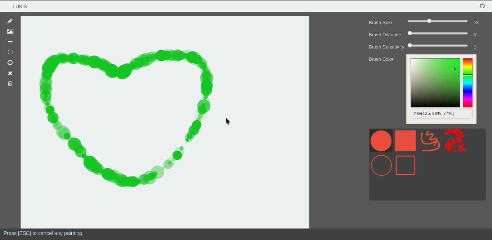

# Lukis

ALPHA - I'm currently doing a rewrite

Lukis is an experimental Painting Apps. Lukis is built on top of [flight](http://twitter.github.io/flight/) and [fabricjs](fabricjs.com).

This application uses event-driven approach. This means that we are trying to decouple each components by making sure that they do not communicate directly. Instead, they should communicate through events.

The above approach is possible by using [flight](http://twitter.github.io/flight/).

For the canvas library, we use fabric.

## Trying it

If you want to try this locally, please have [node](http://nodejs.org/) installed first. You also need to have bower installed:

> npm install -g bower

To install all of the dependancies, please run:

> bower install

I think that's about it. To try the application, just open `apps/index.html`.

## Running the tests

<del>Run `tests/index.html` in your browser of choice. I'm currently checking out [phantomjs](http://phantomjs.org) in order to run the tests from console.</del>

To run the tests, it is expected that `karma` is installed globally:

> npm install -g karma

To run the test, just type the command below on your console:

> karma start

## Building

To build, run:

> r.js -o apps/src/app.build.js

**The next steps is not very efficient. Need to find a better way**

The above script will build the app and place the build file inside `build`. Then, we should make a couple of changes to `build/index.html`:

1. Add `<link href="//netdna.bootstrapcdn.com/font-awesome/3.2.1/css/font-awesome.css" rel="stylesheet">` to `<head>`
2. Changed the loaded script to ``

You can see [the index.html from gh-pages branch](https://github.com/keripix/lukis/blob/gh-pages/build/index.html) to see how the changes take place.

## About folder structure

The sources are placed inside `apps`.

- icon: where some of the icons used by apps are placed

  **TODO**: I've forgotten how I generated the icons here :(

- libs: fabricJS file

  **TODO**: used fabric from bower or npm

- src: Lukis main source code placed here
    
  - brushes: modules that provides brush painting functionality
  - canvasUtils: extends fabricjs functionality

    **TODO**: export this to bower/npm

  - data: files that hold data for Lukis, such as the list of available brush to show to the user.
  - extBrushes: FabricJS plugins that provide new brush functionality

    **TODO**: export this to bower/npm

  - outlineShapes: modules that provides outline painting functionality
  - painters: modules that provides painting functionality
  - services: global services that helps Lukis manage it's resources
  - ui: widgets

- styles: css

## Some Inspirations:

1. [Exploring Canvas Drawing Techniques](http://perfectionkills.com/exploring-canvas-drawing-techniques/)
2. [Harmony](http://www.mrdoob.com/projects/harmony/index.html)
3. [Krita](http://krita.org/)

## TODO

This application is still at it's early stage. So, ofcourse there are a lot of things to do.

- [x] Better Module Naming
- [ ] Improve the architecture
- [x] Start Unit test
- [x] Use PhantomJS to run unit tests (with the help of testem)
- [ ] Shapes
- [ ] More Brushes
- [ ] Canvas Manipulation
- [] Responsive Design
- [] Collaborative Painting
- [] Better build process. More automatic